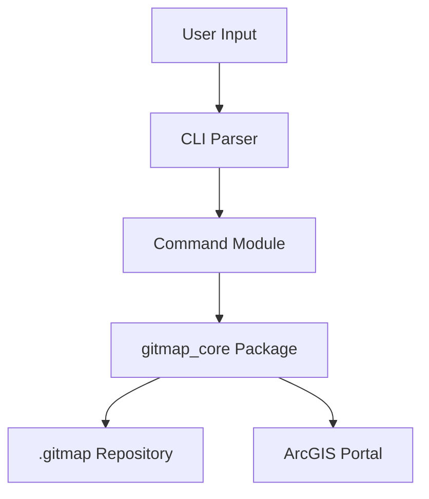

# GitMap CLI Application Specification

## Overview

**Purpose**: Provide a command-line interface for Git-like version control of ArcGIS web maps.

**Scope**: CLI commands for initializing repositories, managing branches, committing changes, and synchronizing with ArcGIS Portal.

**Version**: 0.1.0

## Orchestration Flow



## Inputs/Outputs

### Inputs
- Command-line arguments and options
- User credentials (environment variables or prompts)
- Local `.gitmap` repository

### Outputs
- Terminal output (status, logs, diffs)
- Modified `.gitmap` repository
- Web map items in ArcGIS Portal

## Configuration

Configuration is stored in `.gitmap/config.json`:

```json
{
    "version": "1.0",
    "user_name": "John Doe",
    "user_email": "john@example.com",
    "project_name": "MyProject",
    "remote": {
        "name": "origin",
        "url": "https://www.arcgis.com",
        "folder_id": "abc123",
        "item_id": "def456"
    }
}
```

Environment variables:
- `ARCGIS_USERNAME`: Portal username
- `ARCGIS_PASSWORD`: Portal password

## Error Handling

All commands follow exception handling patterns from `repo_spec.md`:
- Wrap operations in try/except blocks
- Construct descriptive error messages
- Raise RuntimeError with context

## Dependencies

### Internal
- `packages/gitmap_core`: Core library

### External
- `click>=8.1.0`: CLI framework
- `rich>=13.0.0`: Terminal formatting
- `arcgis>=2.3.0`: Portal interaction

## Runbook

### Installation

```bash
pip install -e packages/gitmap_core
pip install -e apps/cli/gitmap
```

### Basic Usage

```bash
# Initialize new repository
gitmap init

# Check status
gitmap status

# Create and switch branches
gitmap branch feature/new-layer
gitmap checkout feature/new-layer

# Commit changes
gitmap commit -m "Added new layer"

# View history
gitmap log

# Push to Portal
gitmap push
```

## Acceptance Criteria

- [ ] All 11 commands implemented and functional
- [ ] Rich terminal output for status, log, diff
- [ ] Portal authentication via environment variables
- [ ] Clear error messages for all failure modes
- [ ] Comprehensive --help for all commands


