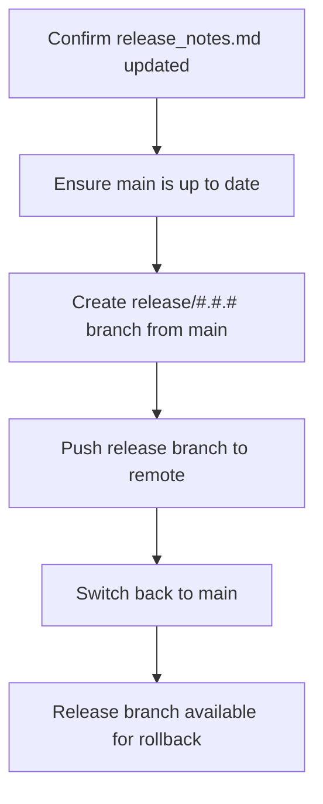

# Cut Release Specification

## Overview

**Purpose**: Define the steps to cut a GitMap release and create a rollback branch.

**Scope**: Creating `release/#.#.#` branch from `main` for rollback purposes. This is the standard release process for all releases.

**Version**: 1.0

## Preconditions

- All changes are complete on your working branch.
- Changes have been merged to `main`.

## Steps

1. On your branch containing changes, confirm that `documentation/project_specs/20-operations/release_notes.md` has been updated:
   - Verify the "Current Versions" table reflects the new GitMap repo version.
   - Verify a new release entry exists at the top of the "Releases" section with complete change descriptions and the new version number.

2. Ensure you're on the `main` branch and it's up to date:
   ```bash
   git switch main
   git pull origin main
   ```

3. Create a new branch from `main` named `release/#.#.#` using the version number from `release_notes.md`:
   ```bash
   git switch -c release/0.0.1
   ```
   (Replace `0.0.1` with your actual version number)

4. Push the release branch to remote and set upstream:
   ```bash
   git push -u origin release/0.0.1
   ```

5. Switch back to `main` to continue development:
   ```bash
   git switch main
   ```

6. The release branch is now available for rollback purposes. Continue working on `main` for future development.

## Mermaid Flow



## Guardrails

- Release branches are for rollback purposes only.
- Do not make changes directly on release branches.
- Continue development on `main` or feature branches.

## References

- [Monorepo Operations Specification](./monorepo_ops_spec.md)
- [Release Notes](./release_notes.md)

