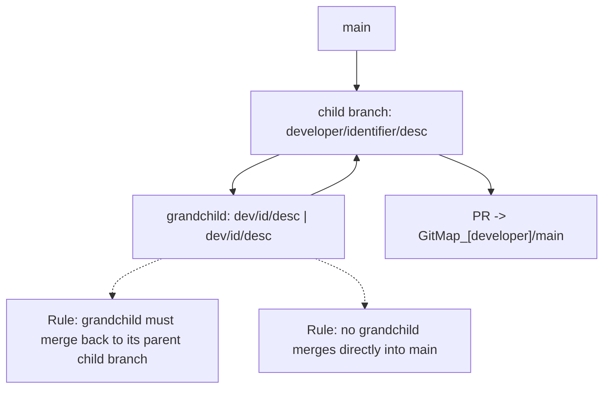

# Monorepo Operations Specification

## Overview

**Purpose**: Standardize day-to-day developer and production operations for GitMap.

**Scope**: Virtual environment lifecycle, developer package workflows, and production wheel management.

**Spec Version**: 1.0

### At-a-Glance

- **Venv root**: `[venv_root_path]` (configure as needed)
- **GitHub root**: `[github_root_path]` (configure as needed)
- **Approved wheels**: `**/releases`


## Virtual Environments (venvs)

**Locations**
- All deployed venvs: `[venv_root_path]` (configure as needed).

**Developer Clones**
- Naming convention: `gitmap_[username]_[ESRI ArcGIS Pro Version]`.

**Activation**
- Activate the target venv before running scripts or packaging commands.

## Site Package Versioning

Follow Semantic Versioning `MAJOR.MINOR.PATCH` for first-party packages in `packages/`.

- **MAJOR**: Increment when introducing breaking changes that require callers, script tools,
  or workflows to change.
- **MINOR**: Increment when adding backwards-compatible functionality. Existing callers continue
  to work without code changes.
- **PATCH**: Increment for bug fixes or internal changes that do not alter the public surface
  or expected behavior.

Version bumps must be reflected in each package's `pyproject.toml` prior to release.

## GitHub

### Repositories

- All cloned repositories live under `[github_root_path]` (configure as needed).
- Naming convention for local clones: `gitmap_[role/username]_[ESRI ArcGIS Pro Version]`
- Examples: `GitMap_main_3.5.4`, `GitMap_production_3.5.4`, `GitMap_[username]_3.5.4`

### Branches

- Developers create child branches from `main`.
- Developers may create grandchild branches from a child branch when needed. Grandchild
  branches must never be merged directly into `main`; they must merge back into their
  parent child branch first.

#### Branch Type Identifiers

- `feature/` – New functionality or enhancements
- `bugfix/` or `fix/` – Non-urgent fixes
- `hotfix/` – Urgent fixes to production
- `release/` – Preparing a release (often temporary)
- `chore/` – Maintenance, cleanup, dependencies
- `refactor/` – Code restructuring without feature changes
- `test/` or `experiment/` – Spikes, prototypes, experimental work
- `docs/` – Documentation updates

#### Branch Naming Convention

- Child: `[developer]/[identifier]/[description]`
- Grandchild: `[developer]/[identifier]/[description] | [developer]/[identifier]/[description]`

#### Branching Flow (Mermaid)



## Package Management – Developers


## Release Guides

Follow the dedicated release guide:
- documentation/project_specs/20-operations/cut_release_spec.md

> **Note:** Developers need to update their local branches from `main` after the release process is complete.

## .gitignore Baseline (source-of-truth)

These patterns should be present in the repo-level ignore rules:

```
*.egg
*.egg-info/
*.whl
dist/
build/
*.tar.gz
*.pyc
__pycache__/
```

## References

- [Documentation Specification](../00-governance/docs_spec.md)
- [Specification Formatting Standards](../00-governance/formatting_spec.md)
- [Architecture Specification](../10-architecture/architecture_spec.md)
- [Repository Specification](../10-architecture/repo_spec.md)

